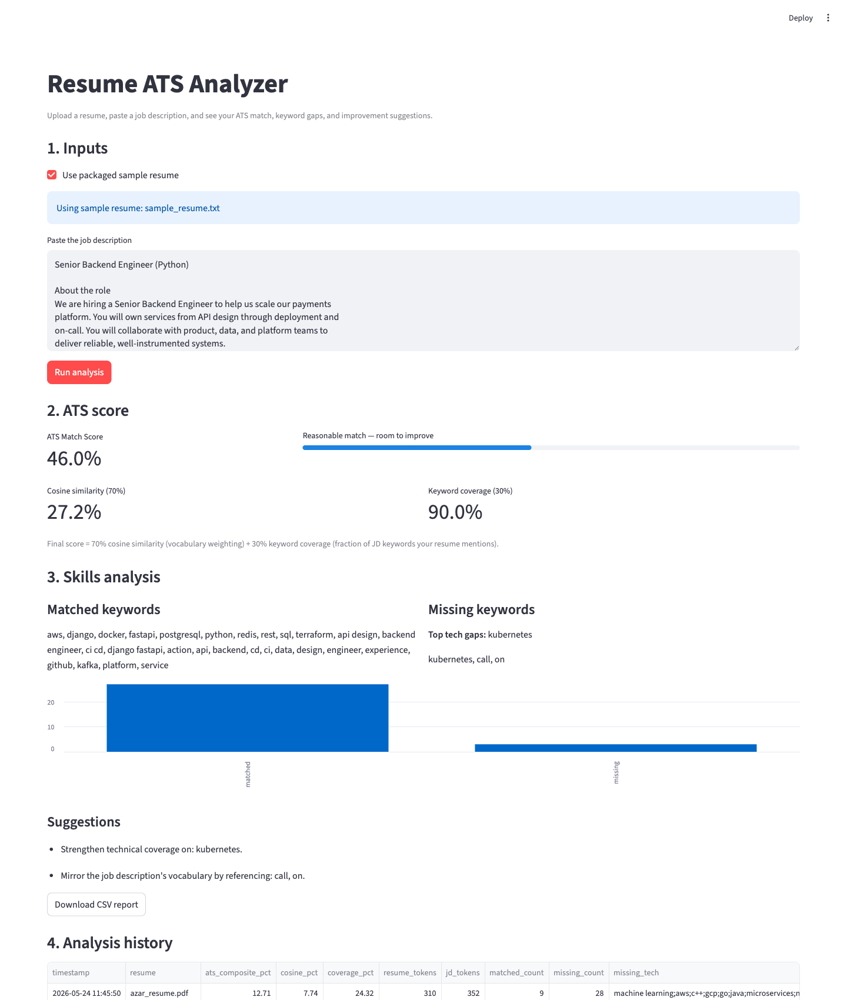

# Resume ATS Analyzer

A Python web application that scores a resume against a job description,
highlights matched and missing skills, and suggests concrete
improvements. Built with Streamlit, scikit-learn, and NLTK.

## Live Demo

> Deployment in progress. Once the app is live on Streamlit Community
> Cloud, the link will appear here:

[Open Dashboard](#) (coming soon)

## Features

- Upload a PDF resume or use the packaged sample.
- Paste any job description.
- TF-IDF + cosine similarity is blended with keyword coverage into a
  single, interpretable ATS match percentage.
- Keyword analysis highlights matched skills, missing skills, and the
  top technical gaps.
- Plain-English improvement suggestions.
- Downloadable CSV report and persistent analysis history.
- Clean Streamlit dashboard with KPIs, bar chart, and history table.
- CLI mode for batch analyses and scripts.

## Tech Stack

- **Python** 3.10+
- **Streamlit** — interactive dashboard.
- **scikit-learn** — TF-IDF vectoriser and cosine similarity.
- **NLTK** — tokenisation, stopwords, and WordNet lemmatisation.
- **pandas** — report frames and history.
- **pdfplumber** + **PyPDF2** — robust PDF text extraction with fallback.

## Project Structure

```
resume-ats-analyzer/
├── analyzer/
│   ├── ats_score.py          # TF-IDF + cosine similarity scoring
│   ├── keyword_analysis.py   # Matched / missing keywords + suggestions
│   └── text_cleaner.py       # Lowercasing, stopword removal, lemmatisation
├── parser/
│   └── resume_parser.py      # PDF extraction (pdfplumber + PyPDF2)
├── dashboard/
│   └── app.py                # Streamlit UI
├── reports/
│   └── report_generator.py   # CSV reports and history
├── utils/
│   ├── helpers.py
│   ├── logger.py
│   └── settings.py           # Paths, knobs, curated tech-skill list
├── data/
│   └── samples/              # Sample resume and job description
├── docs/                     # Screenshots, architecture diagram
├── main.py                   # CLI entry point
├── requirements.txt
└── README.md
```

## Architecture

> Architecture diagram coming soon.

Data flow at a glance:

1. The user uploads a PDF or uses the packaged sample.
2. `parser/resume_parser.py` extracts text via `pdfplumber`, falling
   back to `PyPDF2` on multi-column or image-friendly PDFs.
3. `analyzer/text_cleaner.py` normalises the resume and the job
   description: lowercase, strip URLs/emails/phones, tokenise, drop
   stopwords, lemmatise with WordNet.
4. `analyzer/ats_score.py` vectorises both documents with TF-IDF and
   returns the cosine similarity as a percentage.
5. `analyzer/keyword_analysis.py` extracts the JD's keyword fingerprint
   and computes matched vs. missing terms, surfacing high-signal tech
   skills first.
6. `analyzer/ats_score.compose_score` blends the two metrics into the
   final score (see formula below).
7. `reports/report_generator.py` writes a per-run CSV and appends a row
   to `data/analysis_history.csv` for the dashboard's history view.

### Final ATS score formula

```
ATS Match Score = 0.70 * cosine_pct + 0.30 * keyword_coverage_pct
```

- **Cosine similarity** (70%) — TF-IDF-weighted similarity of the full
  vocabulary. Rewards using rare, on-topic words.
- **Keyword coverage** (30%) — fraction of the JD's top keywords that
  appear in the resume. Easy to interpret for non-technical readers.

Both component scores are shown in the dashboard so users understand
where their final number comes from. Weights live in
`utils/settings.py` (`COMPOSITE_WEIGHT_COSINE`, `COMPOSITE_WEIGHT_COVERAGE`).

## Setup

```bash
# 1. Create and activate a virtual environment.
python -m venv .venv
source .venv/bin/activate          # macOS / Linux
# .venv\Scripts\activate            # Windows

# 2. Install dependencies.
pip install -r requirements.txt
```

NLTK corpora (`stopwords`, `punkt`, `wordnet`) are downloaded
automatically on first use.

## Run the dashboard

```bash
streamlit run dashboard/app.py
```

Open the URL Streamlit prints (usually <http://localhost:8501>). Tick
**Use packaged sample resume** to see an immediate analysis without
uploading anything.

## Run from the command line

```bash
python main.py \
    --resume data/samples/sample_resume.txt \
    --jd data/samples/job_description.txt
```

A timestamped CSV is written under `data/reports/`, and a summary row is
appended to `data/analysis_history.csv`.

## Deploy to Streamlit Community Cloud

1. Sign in at <https://streamlit.io/cloud> with your GitHub account.
2. Click **New app** and pick this repository, the `main` branch, and
   `dashboard/app.py` as the entry point.
3. Streamlit installs `requirements.txt` automatically; NLTK assets are
   downloaded on first request.

The packaged sample resume and job description ensure the app shows a
real analysis on first launch.

## Screenshots

Dashboard overview — inputs, ATS score (cosine + keyword coverage),
skills analysis, and suggestions:



## Future Improvements

- OCR pipeline for image-only/scanned PDFs (e.g. via `pytesseract`).
- Side-by-side comparison of multiple resumes against the same JD.
- Configurable weighting of curated skill categories (cloud, ML, etc.).
- Persistence beyond the container (database or cloud bucket).
- Section-aware extraction (separate "Skills", "Experience" parsing).
- Optional LLM-based rewrite suggestions for missing skills.

## Notes

- The match percentage is a similarity score, not an absolute resume
  grade. Tight, on-topic resumes typically land between 40% and 75%.
- For confidential resumes, run locally; the hosted demo uses sample
  data only.
